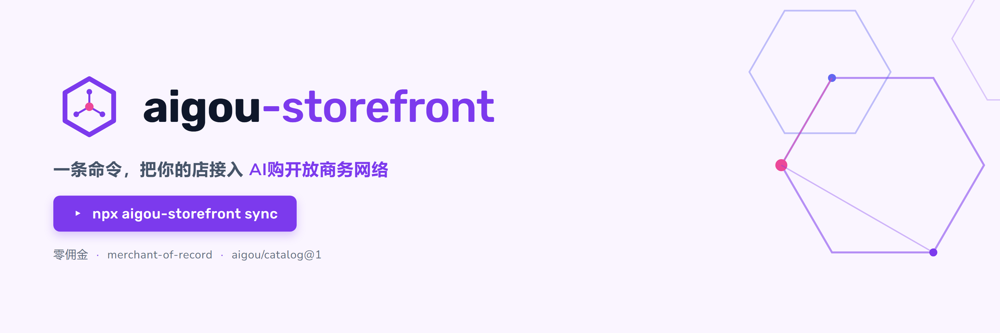

# aigou-storefront — 一条命令把你的店接入 AI购开放商务网络

<p align="center"></p>

把你的商品目录发布为 `aigou/catalog@1` 快照，推送到 AI购目录服务（或自托管），所有接入网络的购物 agent 都能发现你的商品。零佣金、零平台抽成，商家保持 merchant-of-record。

## 快速开始（WooCommerce）

1. 安装 Node.js ≥ 18，然后在你的商店目录：

```bash
npm install -g aigou-storefront   # 或直接 npx aigou-storefront
```

（包尚未发布到 npm 前，可从本仓库安装：`npm install -g /path/to/aigou/storefront`。）

2. 写配置 `aigou-storefront.config.json`：

```json
{
  "store": { "store_id": "acme", "name": "Acme 旗舰店" },
  "source": {
    "type": "woocommerce",
    "base_url": "https://shop.example.com",
    "consumer_key": "ck_你的key",
    "consumer_secret": "cs_你的secret"
  },
  "publish": {
    "mode": "push",
    "catalog_base_url": "http://127.0.0.1:8000",
    "shop_domain": "shop.example.com"
  }
}
```

（WooCommerce key 在 后台 → 设置 → 高级 → REST API 创建，只读权限即可。）

3. 先干跑看一眼，再正式注册并推送：

```bash
aigou-storefront sync --dry-run
aigou-storefront sync --register
```

4. 建议用 cron / 计划任务每天同步一次。改价、上新、下架，下次同步即生效。

## 无 WooCommerce？用 JSON 源

手工（或用你的进销存导出脚本）维护一份快照文件，字段见目录服务的 `GET /catalog/schema`：

```json
{
  "store": { "store_id": "acme", "name": "Acme 旗舰店" },
  "source": { "type": "json", "path": "./products.aigou.json" },
  "publish": { "mode": "file", "path": "./public/aigou-catalog.json" }
}
```

`mode: "file"` 生成可自托管的 `aigou-catalog.json`，上传到你网站的任意公开路径后，在目录服务注册并触发拉取：

```bash
curl -X POST http://127.0.0.1:8000/stores \
  -H "Content-Type: application/json" \
  --data-binary @register.json
# register.json: {"store_id":"acme","name":"Acme 旗舰店",
#   "shop_domain":"shop.example.com","endpoint_type":"catalog_url",
#   "catalog_url":"https://shop.example.com/aigou-catalog.json"}
curl -X POST http://127.0.0.1:8000/stores/acme/refresh
```

注意：目录服务只在收到 `refresh` 调用时拉取（不会自动轮询，可用 cron 定期调用）；且快照内的 `store.store_id` 必须与注册的 `store_id` 一致，否则拉取被拒绝。

## 配置参考

| 字段 | 说明 |
|---|---|
| `store.store_id` | 全网唯一店 ID（注册后绑定你的域名） |
| `store.name` / `store.currency` | 店名（展示用）/ 币种，默认 CNY |
| `source.type` | `woocommerce` 或 `json` |
| `source.base_url` / `consumer_key` / `consumer_secret` | WooCommerce REST v3 凭据 |
| `source.path` | json 源的快照文件路径 |
| `publish.mode` | `push`（推目录服务）或 `file`（写文件自托管） |
| `publish.catalog_base_url` / `shop_domain` | 目录服务地址 / 你的店域名（push 用） |
| `publish.path` | 输出文件路径（file 用） |

## 安全说明

- consumer key/secret 只用于读取商品（只读权限即可），且只在你自己的机器与你的商店之间传输；**请勿在 http 明文环境使用**。
- 工具不会上传任何订单、客户数据；快照只含公开商品信息。

## 路线图

v0.1（本版）：WooCommerce + JSON 源 → 快照推送/自托管。
下一步：MCP 店面端点（search/detail/cart 工具直连，让 agent 可代下单）、微店适配、ACP checkout。

## 品牌资产

`assets/` 下提供可复用的品牌物料（GitHub、npm、社交分享卡片均可直接引用）：

- `assets/banners/minimal-hex-1500x500.png` — README banner（本文顶部）
- `assets/banners/minimal-hex-1200x630.png` — og-image / 社交分享卡片
- `assets/logo.svg` / `assets/logo.png` — logo（矢量 / 512px 透明底）
- `assets/banners/src/` — 各物料的 HTML 源文件，可自行改文案后用 Chrome headless 重导出
